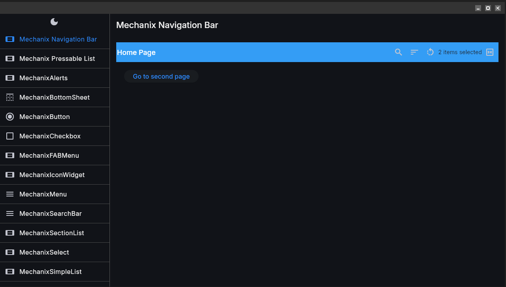
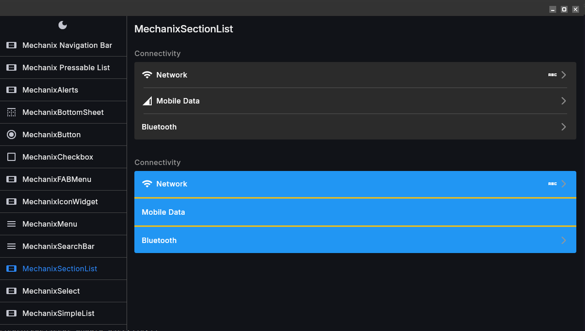
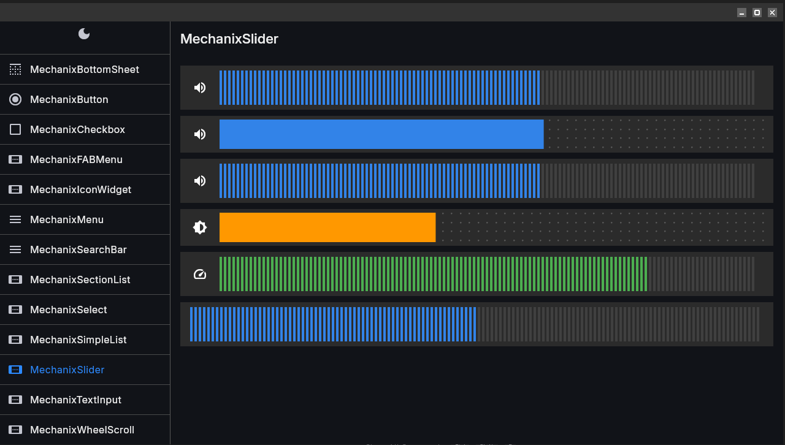

# Mechanix UI

A beautiful, consistent Flutter UI package that implements the Mechanix design system. Built on core principles that prioritize developer experience and seamless integration.

## 🎯 Core Principles

### 🎨 Customization
- **Complete control when you need it, sensible defaults when you don't**

### 🔧 Extensibility  
- **Build upon, not around**

### ⚡ Ease of Use
- **Developer experience as a first-class feature**

### 🚀 0% Configuration
- **Just import and build**

## 🎯 Why Mechanix UI?

### The Problem
When building multiple Flutter applications, maintaining visual consistency across your app ecosystem is challenging. Each app might have different implementations of the same design system, leading to:

- **Inconsistent user experiences** across your app portfolio
- **Duplicate code** for UI components in every project
- **Maintenance overhead** when updating design standards

### The Solution
Mechanix UI provides a unified, drop-in solution that ensures all your applications follow the Mechanix design language effortlessly. Just add the package, and your app automatically adopts the complete Mechanix theme system.


---
## 🎨 Mechanix Theme

A comprehensive theming system that provides complete control over your app's visual appearance with built-in support for multiple variants, dark/light modes, and seamless theme extension integration. The foundation of the Mechanix design system.

### Features

#### Multiple Theme Variants
- **Pre-built Color Schemes** - Multiple Mechanix variants (blue, green, purple, etc.)
- **Dark/Light Theme Pairs** - Complete theme sets for both modes
- **Variant Consistency** - Guaranteed color harmony across all variants
- **Easy Switching** - Change entire color scheme with one property

#### Automatic Theme Management
- **System Theme Detection** - Automatically follows device theme preferences
- **Manual Theme Control** - Full control over theme mode when needed
- **Animated Transitions** - Smooth theme switching animations

### 💻 Application Methods

#### Method 1: Direct Child Application

The **Direct Child** approach is the simplest way to apply MechanixTheme to your application. It's perfect for basic apps, quick prototyping, and situations where you don't need complex theme logic during the build process.

```dart
import 'package:flutter/material.dart';
import 'package:widgets/mechanix.dart';

void main() {
  runApp(MyApp());
}

class MyApp extends StatelessWidget {
  @override
  Widget build(BuildContext context) {
    return MechanixTheme(
      data: MechanixThemeData(
        mechanixVariant: MechanixVariant.blue,
        themeMode: ThemeMode.system,
        useMaterial3: true,
      ),
      child: MaterialApp(
        title: 'My Mechanix App',
        home: HomePage(),
      ),
    );
  }
}
```

#### Method 2: Builder Pattern Application

The **Builder Pattern** approach provides maximum flexibility and control over theme configuration. This method gives you access to the fully resolved `MechanixThemeData` during the build process, allowing for dynamic theme-dependent configurations.

```dart
import 'package:flutter/material.dart';
import 'package:widgets/mechanix.dart';
import 'package:watch_it/watch_it.dart';

void main() {
  runApp(MyApp());
}

class MyApp extends StatelessWidget {
  @override
  Widget build(BuildContext context) {
    final themeMode = watchPropertyValue((ThemeToggle t) => t.themeMode);
    final mechanixVariant = watchPropertyValue(
      (ThemeToggle t) => t.mechanixVariant,
    );

    return MechanixTheme(
      data: MechanixThemeData(
        mechanixVariant: MechanixVariant.blue,
        themeMode: ThemeMode.system,
        useMaterial3: true,
      ),
      builder: (context, mechanixData, child) {
        return MaterialApp(
          theme: mechanixData.lightTheme,     // Access resolved light theme
          darkTheme: mechanixData.darkTheme,   // Access resolved dark theme  
          themeMode: themeMode,   // Use resolved theme mode
          title: 'My Mechanix App',
          home: child,
        );
      },
      child: HomePage(), // Child widget passed to builder
    );
  }
}
```

## Mechanix Widgets

### 🧩 Available Mechanix Widgets

- **MechanixCheckbox**
- **MechanixButton**
- **MechanixAlerts**
- **MechanixSectionList**
- **MechanixSimpleList**
- **MechanixIconWidget**
- **MechanixFABMenu**
- **MechanixNavigationBar**
- **MechanixPressableList**
- **MechanixSlider**
- **MechanixSelect**
- **MechanixMenu**
- **MechanixWheelScroll**
- **MechanixTextInput**
- **MechanixBottomSheet**
- **MechanixSearchBar**

### 🎛️ Run Examples

```bash
$ git clone https://github.com/mecha-org/mechanix.dart.git

$ cd mechanix-ui/flutter/widgets/example/

$ flutter-elinux run
```

### 📦 Integrate

Add to your `pubspec.yaml`:

```yaml
  widgets:
    git:
      url: https://github.com/mecha-org/mechanix.dart.git
      path: flutter/widgets
      ref: main
```


### Mechanix Navigation Bar

#### Examples

```dart
import 'package:flutter/material.dart';
import 'package:widgets/mechanix.dart';

class HomePage extends StatelessWidget {
  @override
  Widget build(BuildContext context) {
    return Scaffold(
      appBar: MechanixNavigationBar(
        title: 'My App',
        actionWidgets: [
          IconButton(
            icon: Icon(Icons.search),
            onPressed: () => print('Search'),
          ),
          IconButton(
            icon: Icon(Icons.settings),
            onPressed: () => print('Settings'),
          ),
        ],
      ),
      body: Container(), // Your page content
    );
  }
}
```

```dart
import 'package:flutter/material.dart';
import 'package:widgets/mechanix.dart';

class HomePage extends StatelessWidget {
  @override
  Widget build(BuildContext context) {
    return Scaffold(
      appBar: MechanixNavigationBar(
        title: "Home Page",
        height: 60,
        backgroundColor: Colors.blue,
        elevation: 30,
        actionWidgets: [
          IconButton(onPressed: () {}, icon: Icon(Icons.search)),
          IconButton(onPressed: () {}, icon: Icon(Icons.sort)),
          IconButton(onPressed: () {}, icon: Icon(Icons.rotate_left)),
          Text("2 items selected"),
          IconButton(onPressed: () {}, icon: Icon(Icons.three_k_outlined))
        ],
      ),
      body: Container(
        padding: EdgeInsets.all(20),
        child: ElevatedButton(
            onPressed: () {
              Navigator.pushNamed(context, "/navigation-second-route");
            },
            child: Text("Go to second page")),
      ),
    );
  }
}
```

#### Screenshot




### Mechanix Section List

#### Example

```dart
MechanixSectionList(
  title: 'Connectivity',
  sectionListItems: [
    SectionListItems(
      title: 'Network',
      onTap: () => onTap(context, AppRoutes.wireless),
      leading: IconWidget(
        iconWidth: 22,
        iconHeight: 18,
        iconPath: Images.wifi,
      ),
    ),
    SectionListItems(
      title: 'Bluetooth',
      onTap: () => onTap(context, AppRoutes.bluetooth),
      leading: IconWidget(
        iconHeight: 20,
        iconWidth: 20,
        iconPath: Images.bluetooth,
      ),
    ),
  ],
)
```

#### Screenshot



### Mechanix Slider

#### 💻Example

```dart
MechanixSlider.dot(
  initialValue: 0.7,
  onChanged: (value) {
    print('Slider value changed: $value');
  },
  onChangeEnd: (value) {
    print('Slider interaction ended: $value');
  },
  leftIcon: IconWidget(
    iconPath: Images.volume,
    iconWidth: 24,
    iconHeight: 24,
  ),
)
```

#### Screenshot


